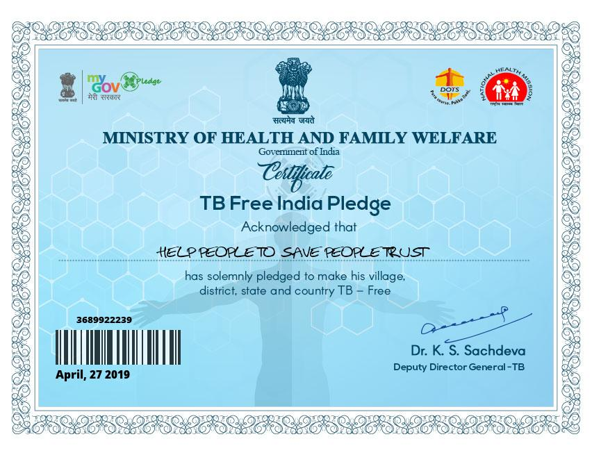

# MedicAI
MedicAI is a tool that provides eHealth Services on a Web Portal and helps you get Virtual Clinical Certifications using Artificial Intelligence.

### Ideas
- [OAuth Login](https://github.com/khanfarhan10/FlaskGoogleOAuth) - EAadhaar, currently Google
- Dashboard for Various Tests - COVID CXR, CT Scan , One more famous virus spread from china itself ++
- Detailed (Verbose) Analytics Report - Percentage of Suspectance | Clinical Tests Required? Yes: Follow the steps : Nearest Hospital Vacant Access GPS ++ No. Go ahead. Wait for radiologist results???
- Certified PDF generation - Govt Logos, Percentage of Suspectance , Validity : Green , Unique Identification Number, Barcode

#### Generated Certifications

  

#### Sample Certs
- http://helppeopletosavepeopletrust.weebly.com/achievement-certificate.html

  

  

<!--

-->
